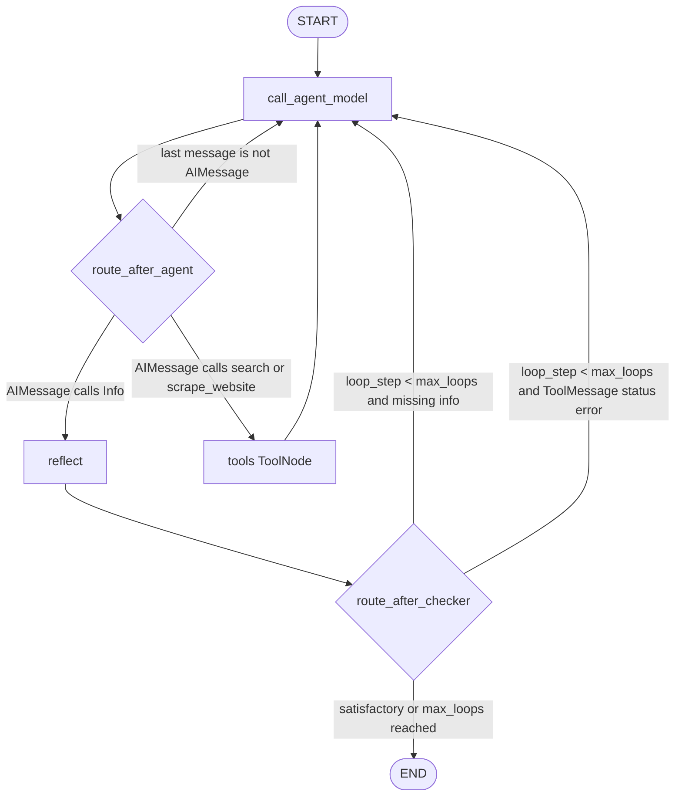

# Reference Data Flow

## 1. Graph



源码证据：Graph 创建、节点、边和编译见 `src/enrichment_agent/graph.py:L216-L228`；路由逻辑见 `src/enrichment_agent/graph.py:L163-L213`。

## 2. 端到端数据流

| 步骤 | 输入 | 转换 | 输出 | 执行者 | 代码位置 | 可能失败 |
|---|---|---|---|---|---|---|
| 1 | `topic` | 外部调用传入 Graph input | `InputState.topic` | USER | `src/enrichment_agent/state.py:L15-L23` | 空 topic、注入、领域不匹配 |
| 2 | `extraction_schema` | 外部调用传入 Graph input | `InputState.extraction_schema` | USER | `src/enrichment_agent/state.py:L22-L23` | 非法 JSON Schema、过大 schema、恶意描述 |
| 3 | RunnableConfig | `ensure_config()` 后筛选 dataclass 字段 | `Configuration` | DETERMINISTIC CODE | `src/enrichment_agent/configuration.py:L54-L62` | 未做范围校验；未知字段被忽略 |
| 4 | `extraction_schema` | 包成 `Info` tool 的 `parameters` | 动态 tool schema | DETERMINISTIC CODE | `src/enrichment_agent/graph.py:L37-L42` | 无效 schema 延迟到 bind/invoke 失败 |
| 5 | `topic` + schema | `configuration.prompt.format(...)` | HumanMessage prompt | DETERMINISTIC CODE | `src/enrichment_agent/graph.py:L44-L50` | prompt 注入、schema 描述诱导 |
| 6 | config `model` | `init_chat_model()` 初始化模型 | raw_model | DETERMINISTIC CODE | `src/enrichment_agent/utils.py:L25-L34` | 缺 API key、模型名不支持 |
| 7 | prompt + history | `bind_tools(..., tool_choice="any")` 后 `ainvoke` | AIMessage with tool calls | MODEL | `src/enrichment_agent/graph.py:L52-L55` | 模型选错工具、无 tool_calls、幻觉 |
| 8 | AIMessage | 提取 `Info` tool args 或追加提醒 | `info`、`messages`、`loop_step + 1` | DETERMINISTIC CODE | `src/enrichment_agent/graph.py:L60-L82` | 只取第一个 Info；未校验事实 |
| 9 | last AIMessage | 判定下一节点 | `reflect` 或 `tools` | ROUTER | `src/enrichment_agent/graph.py:L163-L186` | 只看第一个 tool call；异常消息回到模型 |
| 10 | search tool call | `TavilySearch.ainvoke({"query": query})` | 搜索结果 list | EXTERNAL TOOL | `src/enrichment_agent/tools.py:L23-L34` | Tavily 错误、过时、网络/API key 失败 |
| 11 | scrape tool call | aiohttp GET URL | 网页 content | EXTERNAL TOOL | `src/enrichment_agent/tools.py:L52-L65` | URL 不可达、HTML 噪声、无 timeout |
| 12 | 网页 content + schema | 截断前 40000 字符并模型总结 | notes string | MODEL | `src/enrichment_agent/tools.py:L67-L74` | 摘要幻觉、遗漏、误读网页 |
| 13 | tool outputs | `ToolNode` 写回消息 reducer | ToolMessage in `messages` | DETERMINISTIC CODE | `src/enrichment_agent/graph.py:L222-L225`，`src/enrichment_agent/state.py:L39-L67` | 工具异常处理依赖框架默认 |
| 14 | `info` + history | Reflection prompt + structured output | `InfoIsSatisfactory` | MODEL | `src/enrichment_agent/graph.py:L123-L135` | 自评误判、未发现事实错误 |
| 15 | Reflection result | ToolMessage success/error | 继续或结束依据 | DETERMINISTIC CODE | `src/enrichment_agent/graph.py:L136-L160` | error 只作为消息，不是独立错误状态 |
| 16 | `loop_step`、`info`、ToolMessage status | 条件路由 | `call_agent_model` 或 END | ROUTER | `src/enrichment_agent/graph.py:L189-L213` | 达上限后可能带不完整结果结束 |
| 17 | `state.info` | `OutputState` 暴露 | 最终 `info` dict | DETERMINISTIC CODE | `src/enrichment_agent/state.py:L75-L87` | 输出不含来源、置信度、错误状态 |

## 3. State 字段读写矩阵

| State 字段 | 初始来源 | 读取节点 | 写入节点 | 更新方式 | 风险 |
|---|---|---|---|---|---|
| `topic` | 用户输入 | `call_agent_model`、`reflect` | 无 | 普通字段 | 未做确定性校验 |
| `extraction_schema` | 用户输入 | `call_agent_model`、`reflect`、`scrape_website` | 无 | 普通字段 | 动态工具 schema 未预校验 |
| `info` | 用户可选；模型 `Info` tool args | `reflect`、`route_after_checker`、OutputState | `call_agent_model`、`reflect` | 替换 | 格式可能合法但事实错误 |
| `messages` | 默认 `[]` | `call_agent_model`、`reflect`、两个 router、ToolNode | `call_agent_model`、ToolNode、`reflect` | `add_messages` 追加/同 ID 替换 | 保存原始模型和工具消息，可能累积噪声 |
| `loop_step` | 默认 `0` | `route_after_checker` | `call_agent_model` | `operator.add` 累加 | 工具循环不受此路由直接限制 |

State 定义证据：`InputState`、`State`、`OutputState` 分别见 `src/enrichment_agent/state.py:L15-L27`、`src/enrichment_agent/state.py:L29-L72`、`src/enrichment_agent/state.py:L75-L87`。

## 4. Node 输入输出表

| Node | 类型 | 输入 | 输出 | 外部依赖 | 源码位置 |
|---|---|---|---|---|---|
| `call_agent_model` | MODEL | `State` + `RunnableConfig` | `messages`、`info`、`loop_step` | 选定 chat model | `src/enrichment_agent/graph.py:L22-L82` |
| `route_after_agent` | ROUTING | `state.messages[-1]` | 路由 label | 无 | `src/enrichment_agent/graph.py:L163-L186` |
| `tools` | TOOL | 模型 tool calls | ToolMessage(s) | Tavily、HTTP、模型摘要 | `src/enrichment_agent/graph.py:L222-L225`，`src/enrichment_agent/tools.py:L23-L74` |
| `reflect` | MODEL | `State` + `RunnableConfig` | ToolMessage success/error，可能 `info` | 选定 chat model | `src/enrichment_agent/graph.py:L101-L160` |
| `route_after_checker` | ROUTING | `loop_step`、`info`、最后 ToolMessage、config | END 或 `call_agent_model` | 无 | `src/enrichment_agent/graph.py:L189-L213` |

## 5. Tool 调用链

搜索链：

```text
MODEL: call_agent_model 生成 {"name": "search", "args": {"query": "..."}}
DETERMINISTIC CODE: ToolNode 分发
EXTERNAL TOOL: TavilySearch(max_results=config.max_search_results).ainvoke({"query": query})
DETERMINISTIC CODE: ToolMessage 写回 State.messages
MODEL: call_agent_model 读取搜索结果继续
```

证据：`bind_tools([scrape_website, search, info_tool], tool_choice="any")` 在 `src/enrichment_agent/graph.py:L52-L55`；`search` 在 `src/enrichment_agent/tools.py:L23-L34`；ToolNode 在 `src/enrichment_agent/graph.py:L222-L225`。

抓网页链：

```text
MODEL: call_agent_model 生成 {"name": "scrape_website", "args": {"url": "..."}}
EXTERNAL TOOL: aiohttp GET url
MODEL: raw_model.ainvoke(_INFO_PROMPT with content[:40000])
DETERMINISTIC CODE: 返回摘要字符串为 ToolMessage
```

证据：`scrape_website` 在 `src/enrichment_agent/tools.py:L52-L74`。

`Info` 提交链：

```text
MODEL: call_agent_model 生成 {"name": "Info", "args": {...}}
DETERMINISTIC CODE: 从 tool_calls 中取 Info args 写入 state.info
ROUTER: route_after_agent 进入 reflect
MODEL: reflect 判断满意度
ROUTER: route_after_checker END 或继续
```

证据：`Info` tool 定义和提取见 `src/enrichment_agent/graph.py:L37-L42`、`src/enrichment_agent/graph.py:L60-L71`。

## 6. 模型调用链

| 次序 | 调用 | 模型配置 | Prompt 来源 | 输入消息 | 输出进入 State | 校验 |
|---|---|---|---|---|---|---|
| 1 | `call_agent_model` | `Configuration.model` -> `init_model` | `Configuration.prompt` 默认 `prompts.MAIN_PROMPT` | `[HumanMessage(prompt)] + state.messages` | AIMessage、`info`、`loop_step` | 无事实校验 |
| 2 | `scrape_website` | 同一 `init_model(config)` | `_INFO_PROMPT` | URL、schema、网页前 40000 字符 | ToolMessage content | 无来源定位 |
| 3 | `reflect` | 同一 `init_model(config)` | `MAIN_PROMPT` + checker prompt | 历史消息、`presumed_info` | ToolMessage artifact/status，可能 `info` | Pydantic 只约束 checker 结构 |

证据：模型初始化 `src/enrichment_agent/utils.py:L25-L34`；主模型调用 `src/enrichment_agent/graph.py:L52-L55`；抓网页模型调用 `src/enrichment_agent/tools.py:L67-L74`；Reflection 调用 `src/enrichment_agent/graph.py:L133-L135`。

## 7. 循环和结束条件

`call_agent_model` 每次返回 `"loop_step": 1`，由 `operator.add` 累加（`src/enrichment_agent/graph.py:L77-L82`，`src/enrichment_agent/state.py:L69-L70`）。`route_after_checker` 只在 Reflection 之后检查 `state.loop_step < configurable.max_loops`；若未达上限且无 `info` 或最后 ToolMessage 为 `error`，继续 `call_agent_model`；否则 END（`src/enrichment_agent/graph.py:L197-L213`）。

关键限制：

| 限制 | 是否生效 | 证据 |
|---|---|---|
| `max_loops` 默认 6 | Reflection 后生效 | `src/enrichment_agent/configuration.py:L47-L52`，`src/enrichment_agent/graph.py:L197-L213` |
| `max_search_results` 默认 5 | Tavily search 生效 | `src/enrichment_agent/configuration.py:L33-L38`，`src/enrichment_agent/tools.py:L31-L33` |
| `max_info_tool_calls` 默认 3 | 未发现使用 | `src/enrichment_agent/configuration.py:L40-L45`；源码搜索仅定义 |
| 工具调用最大次数 | 未见显式限制 | `tools -> call_agent_model` 边直接返回主模型，`src/enrichment_agent/graph.py:L225-L226` |

## 8. 失败位置清单

| 位置 | 失败模式 | 当前表现 |
|---|---|---|
| 输入 schema | 非法 JSON Schema | 项目不预校验；可能在 tool binding/model 调用时失败 |
| 配置模型 | 模型名错误或 key 缺失 | `init_chat_model` 或 `ainvoke` 抛错 |
| 搜索 | Tavily key 缺失、限流、返回低质结果 | 无本地捕获 |
| 抓网页 | URL 失败、超时、HTML 非正文 | 无 timeout/正文抽取 |
| 网页摘要 | 模型误读网页 | 无确定性校验 |
| 主模型 | 不调用工具或调用错误工具 | 无 tool_calls 时追加 HumanMessage 要求调用工具 |
| 最终 Info | 字段伪造、混淆来源 | Reflection 可能发现明显问题，但不保证 |
| Reflection | 自检误判 | `InfoIsSatisfactory` 只保证格式 |
| 循环 | 一直工具调用 | 无工具路径预算路由 |
| 达上限 | 不完整仍 END | 无错误态输出 |

## 9. 关键结论对应源码

| 结论 | 源码位置 |
|---|---|
| Graph 入口为 `graph.py:graph` | `langgraph.json:L4-L6` |
| `.env` 被 LangGraph 配置加载 | `langgraph.json:L7` |
| 输入为 dataclass `InputState` | `src/enrichment_agent/state.py:L15-L27` |
| 内部 messages 使用 `add_messages` reducer | `src/enrichment_agent/state.py:L39-L67` |
| `loop_step` 使用加法 reducer | `src/enrichment_agent/state.py:L69-L70` |
| 动态 `Info` tool 来自用户 schema | `src/enrichment_agent/graph.py:L37-L42` |
| 主模型绑定 search/scrape/Info | `src/enrichment_agent/graph.py:L52-L55` |
| 主模型输出写入 messages/info/loop_step | `src/enrichment_agent/graph.py:L72-L82` |
| Reflection 是模型结构化输出 | `src/enrichment_agent/graph.py:L85-L98`，`src/enrichment_agent/graph.py:L133-L135` |
| Tavily 是 search 实现 | `src/enrichment_agent/tools.py:L23-L34` |
| scrape 会再次调用模型总结 | `src/enrichment_agent/tools.py:L67-L74` |
| Graph 节点和边 | `src/enrichment_agent/graph.py:L220-L226` |
| Graph compile | `src/enrichment_agent/graph.py:L228-L229` |
| 代码默认模型 | `src/enrichment_agent/configuration.py:L17-L18` |
| README 旧默认模型 | `README.md:L42-L46`，`README.md:L173-L176` |
| 无经典 RAG 依赖 | `pyproject.toml:L11-L19` |
